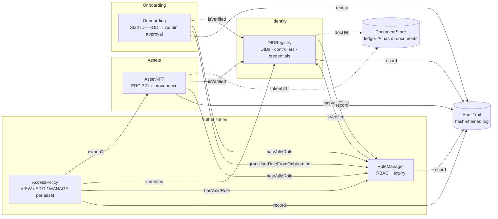

# Decentralized Identity, Asset Ownership & Access Control

[](https://github.com/bala2456u/decentralized-identity-rbac/actions/workflows/ci.yml)


> **Challenge 21** — a decentralized system for managing user identities, digital-asset ownership and access
> permissions, where every record is verifiable, resistant to unauthorised modification, and fully auditable.

Seven smart contracts, one rule: **no identity, no rights.** Every role, every asset transfer and every permission in
this system is bound to a self-sovereign decentralized identifier (DID). Suspend the identity and everything attached
to it — roles, the ability to move assets, the permissions it was granted — stops working in the same block.
Every one of those events lands in a hash-chained, append-only audit log that anyone can verify.

Getting *into* the organisation is itself enforced by contract: a new person submits their Staff ID, name and
department, their **Head of Department** approves, then an **Admin** approves — in that order, with no self-approval —
and only then does the contract grant them the right to hold assets. Every identity carries a human-readable
reference (`Dave Kumar · STAFF-1042`), so the dApp never shows a raw hash where a person belongs.

Documents can **live on the ledger itself**: an ID document, a certificate or a published contract is stored under
its own fingerprint (`ledger://<hash>`), so the link can never go dead or be swapped, and a public **Verify** page —
reachable by QR code, no account needed — lets an employer, auditor or other department confirm any person, asset
or certificate and check that a copy they were handed matches what was recorded.

---

## Objectives → what was built

| # | Objective | How it is met | Where |
|---|-----------|---------------|-------|
| 1 | Decentralized, cryptographically verifiable identities | Self-registered `did:yhack:<chainId>:<address>` DIDs. Only the subject can create its own DID; the document lives off-chain and only its hash is anchored. EIP-712 verifiable credentials are signed by issuers and verified on-chain with `ecrecover`. | [`DIDRegistry.sol`](contracts/DIDRegistry.sol) |
| 2 | Digital assets as unique, traceable NFTs | ERC-721 with an on-chain provenance list per token and a content-hash uniqueness check: the same file can never be minted twice. | [`AssetNFT.sol`](contracts/AssetNFT.sol) |
| 3 | Ownership linked to identity | A token can only be minted to, or transferred to, an account whose DID is active *and* holds `USER_ROLE`. The sender must also have an active DID. `ownerDID(tokenId)` resolves any asset to its holder's DID. | `AssetNFT._update` |
| 4 | Role-Based Access Control | `ROOT → ADMIN → ISSUER / AUDITOR / HOD / USER` on OpenZeppelin `AccessControl`, extended with role expiry and a hard rule that a role can only be granted to an active DID. `USER_ROLE` is normally granted by the onboarding workflow itself. | [`RoleManager.sol`](contracts/RoleManager.sol) |
| 5 | Smart contracts enforce the rules | Every rule is enforced in Solidity, not the UI. Mint, transfer, burn all funnel through one `_update` choke point; permission changes through one `_grant`; onboarding is a state machine (`PendingHOD → PendingAdmin → Approved`) whose stages cannot be skipped, reordered or self-approved. The React app only reflects what the chain allows. | all contracts, [`Onboarding.sol`](contracts/Onboarding.sol) |
| 6 | Identity, ownership and access activity recorded on-chain | Indexed events on every state change **plus** a dedicated `AuditTrail` contract that only system contracts can write to. | [`AuditTrail.sol`](contracts/AuditTrail.sol) |
| 7 | Prevent unauthorised creation, transfer, permission change | 40+ negative tests prove it: unauthorised minting, transfers to unregistered accounts, self-promotion to admin, signature replay, grants by non-owners — all revert with named custom errors. | [`test/`](test) |
| 8 | Transparent verification and audit | The audit log is a hash chain (`verifyChain` recomputes it and reports the first broken entry). Per-asset provenance, per-address history, credential verification and effective-permission checks are all public `view` functions surfaced in the dApp's **History** tab. A public **Verify** tab (with QR codes and shareable `#verify=` links) checks any person, asset or certificate and fingerprints a pasted document against the record. | `AuditTrail.verifyChain`, [`DocumentStore.sol`](contracts/DocumentStore.sol), [`frontend/`](frontend) |

---

## Architecture



| Contract | Responsibility | Key guarantees |
|----------|----------------|----------------|
| **DIDRegistry** | Identity lifecycle and verifiable credentials | Self-sovereign registration · soulbound (no transfer exists) · controller rotation for key recovery · admin-locked suspension · EIP-712 credentials with per-issuer nonces |
| **RoleManager** | Roles and their hierarchy | `_grantRole` refuses accounts without an active DID (applies to the constructor too) · optional expiry · `hasValidRole` = role ∧ not expired ∧ identity active |
| **AssetNFT** | Assets as ERC-721 | Issuer-only mint · content-hash uniqueness · recipient must be DID+USER · sender must be active · admin freeze · provenance kept even after burn |
| **AccessPolicy** | Who may VIEW / EDIT / MANAGE an asset | Owner implicitly MANAGE · MANAGE may delegate below itself · time-boxed grants · **all grants lapse automatically when the asset changes hands** · gasless EIP-712 grants with nonce + deadline |
| **Onboarding** | Approved entry into the organisation, and readable references | Applicant needs an active DID · `submit → approveByHOD → approveByAdmin` enforced as a state machine · first approver must be the registered head of *that* department · no self-approval · Staff IDs are unique · rejection with an on-record reason, resubmission allowed · final approval makes the contract grant `USER_ROLE` (the only role any contract can grant) |
| **DocumentStore** | Documents that verify themselves | Content-addressed: stored under `keccak256(content)`, so `ledger://<hash>` *is* the fingerprint · idempotent (re-storing identical bytes is a no-op, first storer stays on record) · 24 KB cap — large or private files stay off-chain, fingerprint-only |
| **AuditTrail** | Tamper-evident history | Append-only · writer allow-list (not even the admin can write directly) · each entry commits to the previous hash · `verifyChain(from,to)` |

---

## Security properties

| Threat | Mitigation |
|--------|------------|
| Identity theft / impersonation | DIDs are keyed by the caller's own address and cannot be created for someone else or transferred. Credentials are EIP-712 signed and bound to chain + contract; the contract recovers the signer and checks it holds `ISSUER_ROLE`. |
| Compromised key | Controller rotation moves document-edit rights to a new key. Suspending the identity freezes its assets in place and voids its roles and permissions instantly. |
| Unauthorised asset creation | Only `ISSUER_ROLE`. Same content hash cannot be minted twice. |
| Unauthorised transfer | Enforced in `_update`, through which every ERC-721 path passes. Recipient must hold an active DID + `USER_ROLE`; sender must be active; asset must not be frozen. |
| Privilege escalation | Role admin hierarchy (`ROOT` guards `ADMIN`, `ADMIN` guards the rest). Suspended admins lose admin power — the rule has no exemptions. |
| Out-of-order, out-of-department or self-approved onboarding | Each approval function checks the request is in exactly the stage it expects; stage one is restricted to the registered head of the applicant's department; both stages reject `msg.sender == applicant`. Only the Onboarding contract can trigger the resulting role grant. |
| Stale permissions after a sale | Every grant records the owner at the time; a change of owner invalidates it with no extra transaction. |
| Signature replay | Both signed flows (credentials, gasless grants) use a per-signer nonce and the EIP-712 domain (chain id + contract address). Grants also carry a deadline. |
| Audit tampering | The log is a hash chain with no update/delete path. Only allow-listed contracts can append. |
| Forged or edited documents; links that go dead or get swapped | Every record carries a fingerprint; the Verify page re-hashes any pasted copy in the browser and compares. Documents stored on the ledger are addressed by their own hash, so what you fetch is provably what was registered. |
| Personal data leakage | Nothing personal goes on-chain: DID documents, credential evidence and asset files are referenced by hash / URI only. |

**Known limitations** (deliberate scope decisions for a hackathon build): no social/multisig recovery of assets held by a lost key — an admin can suspend the identity but not move the asset; `DIDRegistry.admin` and `AuditTrail.admin` are single keys and would be a multisig in production; the identity method `did:yhack` is custom rather than a registered DID method.

---

## Quick start

Requirements: **Node.js 20+**. Nothing else — no wallet or testnet needed for the tests.

```bash
git clone https://github.com/bala2456u/decentralized-identity-rbac.git
cd decentralized-identity-rbac
npm install
npm test
```

You should see **101 passing**. Roughly half of those tests are attacks that must fail.

### Run the full stack locally

```bash
# 1. local chain (keep this terminal open)
npm run node

# 2. deploy + wire the five contracts, then load demo data
npm run deploy:local
npm run seed:local

# 3. the dApp
cd frontend && npm install && npm run dev
```

Open <http://localhost:5173>. **No wallet is needed on the local chain**: the header shows an *Act as…* picker with
Hardhat's public demo accounts, so you can switch between admin, issuer, alice, bob and a brand-new user with one click.
(A real wallet such as MetaMask works too — RPC `http://127.0.0.1:8545`, chain id `31337` — and is required on
testnets, where the picker does not appear.) The seed script uses the accounts in this order:

| # | Account | Staff ID | Identity | Roles | Holds |
|---|---------|----------|----------|-------|-------|
| 0 | admin — Priya Nair | STAFF-0001 | ✓ | ROOT, ADMIN | — |
| 1 | issuer — Ravi Shankar | STAFF-0002 | ✓ | ISSUER | — |
| 2 | auditor — Meera Joshi | STAFF-0003 | ✓ | AUDITOR | — (cannot hold assets: no USER_ROLE) |
| 3 | alice — Alice Fernandes | STAFF-1001 | ✓ | USER *(via onboarding)* | assets #1 (contract), #2 (design spec) · credential `EMPLOYEE_VERIFIED` |
| 4 | bob — Bob Mehta | STAFF-1002 | ✓ | USER *(via onboarding)* | asset #3 (semester marksheet) · VIEW on #1 · MANAGE on #2 |
| 5 | carol — Carol Iyer | STAFF-1003 | ✓ | USER *(via onboarding)* | EDIT on #1 (7 days) |
| 6 | dave | — | ✗ | — | the newcomer for the live demo: starts with nothing |
| 7 | hod — Arjun Rao | STAFF-0010 | ✓ | HOD, head of Procurement & Finance | — |

### Show it on a phone (same Wi-Fi)

`npm run node` listens on all interfaces and `npm run dev` prints a **Network:** address such as
`http://192.168.1.23:5173`. Open the app from that address (not `localhost`) and every QR code / verify link it
generates carries the Wi-Fi address, so any phone or laptop on the same network can scan it and land on the Verify
page. The site finds the local chain through the same address automatically. (Windows may ask once to allow Node
through the firewall — say yes for private networks.)

### Going online (anyone, anywhere)

Two halves, both free:

1. **The site** — the [`pages.yml`](.github/workflows/pages.yml) workflow publishes `frontend/` to GitHub Pages on
   every push: `https://<owner>.github.io/decentralized-identity-rbac/`.
2. **The chain** — deploy the contracts to a public test network (below) and commit the resulting
   `deployments/sepolia.json` + `frontend/src/deployments.json`. The published site then reads that network through a
   public RPC, so verify links and QR codes work for anyone with no wallet, and people with a wallet can act.

### Deploy to a testnet

```bash
cp .env.example .env      # fill in PRIVATE_KEY and an RPC URL (Alchemy/Infura free tier)
npm run deploy:sepolia    # or deploy:amoy
```

The script writes `deployments/<network>.json` and exports ABIs + addresses into `frontend/src/`, so the dApp works
on that network as soon as you switch your wallet to it.

---

## Five-minute demo script

Open **Start here** first. It tells the story of Dave, a new employee, and shows live which of his five onboarding
steps are done for whichever person is selected under *Try as*. Then walk the rules — every refusal shows a
plain-English reason with the exact contract error underneath:

1. **Onboard Dave, in order** — *Try as → dave*. **My Digital ID** → create his ID. **Onboarding** → Staff ID
   `STAFF-1042`, name, department *Procurement* → *Submit for approval*. From here on every screen shows
   "Dave Kumar · STAFF-1042" instead of his address.
   Now try to skip a stage: *Try as → admin*, **Onboarding** — his request is **not** in the admin's queue, and the
   contract would refuse anyway (*"This request is not at that stage"*). *Try as → hod* → **Approve**. Back as *admin*
   → now it appears → **Approve**. Dave's timeline shows both approvers and *"User role granted — automatically by the
   contract"*. *Try as → issuer*: **Assets** → register a contract owned by Dave. Back as *dave*: Start here shows
   steps 1–5 ticked.
2. **Blocked by design** — as *issuer*, try to register an asset for a random address → *"has no active Digital ID"*.
   Try one for *auditor* (has an ID, never onboarded) → *"not the User role yet … needs to complete onboarding"*.
   As *hod*, try to approve your own request → *"You can't approve your own onboarding request."*
3. **Ownership follows identity** — as *alice*, **Assets** → send asset #1 to *bob*. *Find an asset* #1: the ownership
   history has a new entry and the owner's ID changed. bob's View and carol's Edit shares on #1 have
   **lapsed automatically** — see **Sharing → Everyone an asset is shared with**.
4. **Suspension is total** — as *admin*, **My Digital ID → Check someone's Digital ID** → look up *bob* → *Suspend this
   ID*. **Roles → Check someone's roles** now says "held, but not in force". As *bob*, try to send #1 anywhere → refused.
   Reactivate as admin; everything comes back.
5. **Sign now, submit later** — as *alice*, **Sharing** → asset #2, share with *carol*, click *Sign now, submit later*
   and copy the JSON. As *carol*, paste it under *Submit a share someone signed* → it applies, paid by carol,
   authorised by alice. Submit it again → *"already used"*.
6. **History** — every step above is there with who did it, who it was about and a reference. Click *Verify the whole
   log*. The refused attempts are absent — they never happened.
7. **Documents that verify themselves** — **Assets → Find** #1: its file is `ledger://…` — click *Open & verify*: the
   contract text comes back from the chain with *"✔ matches the fingerprint on record"*. Click *Verify page & QR →*:
   a public page with a QR code. Paste the contract text into *Been handed a copy?* → *"✔ Genuine"*. Change one
   character → *"✘ Does not match"*. Open the link in a private window: it works with no account at all.

---

## Project layout

```
contracts/
  DIDRegistry.sol       identity + credentials
  RoleManager.sol       RBAC with expiry, DID-gated
  AssetNFT.sol          ERC-721 assets with provenance
  AccessPolicy.sol      per-asset permissions
  Onboarding.sol        Staff IDs + HOD → Admin approval workflow
  DocumentStore.sol     content-addressed documents (ledger://<hash>)
  AuditTrail.sol        hash-chained log
  interfaces/           minimal cross-contract surfaces
  libraries/            AuditActions constants
test/                   101 tests, one file per contract + shared fixture
scripts/
  deploy.js             deploy + wire + export to frontend
  seed.js               demo data for a local node
  export-abi.js         copies ABIs into frontend/src/abi
frontend/               React + Vite + ethers v6 dApp (Start here · My Digital ID · Onboarding · Roles · Assets · Sharing · History · Verify)
deployments/            one JSON per network with contract addresses
.github/workflows/      CI: compile, test, build frontend
```

## Tech

Solidity 0.8.28 (Cancun) · OpenZeppelin Contracts 5 · Hardhat 2 · ethers v6 · React 18 · Vite 5

## License

MIT
