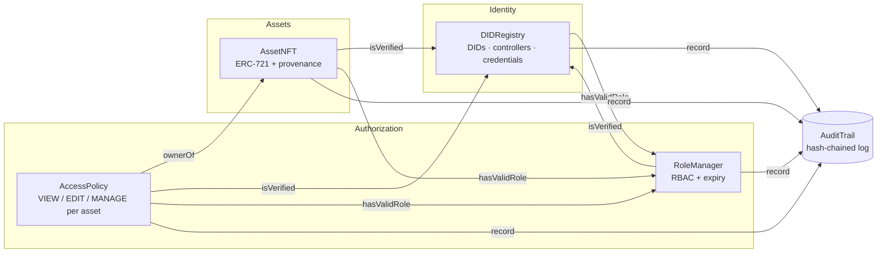

# Decentralized Identity, Asset Ownership & Access Control

[](https://github.com/bala2456u/decentralized-identity-rbac/actions/workflows/ci.yml)


> **Challenge 21** — a decentralized system for managing user identities, digital-asset ownership and access
> permissions, where every record is verifiable, resistant to unauthorised modification, and fully auditable.

Five smart contracts, one rule: **no identity, no rights.** Every role, every asset transfer and every permission in
this system is bound to a self-sovereign decentralized identifier (DID). Suspend the identity and everything attached
to it — roles, the ability to move assets, the permissions it was granted — stops working in the same block.
Every one of those events lands in a hash-chained, append-only audit log that anyone can verify.

---

## Objectives → what was built

| # | Objective | How it is met | Where |
|---|-----------|---------------|-------|
| 1 | Decentralized, cryptographically verifiable identities | Self-registered `did:yhack:<chainId>:<address>` DIDs. Only the subject can create its own DID; the document lives off-chain and only its hash is anchored. EIP-712 verifiable credentials are signed by issuers and verified on-chain with `ecrecover`. | [`DIDRegistry.sol`](contracts/DIDRegistry.sol) |
| 2 | Digital assets as unique, traceable NFTs | ERC-721 with an on-chain provenance list per token and a content-hash uniqueness check: the same file can never be minted twice. | [`AssetNFT.sol`](contracts/AssetNFT.sol) |
| 3 | Ownership linked to identity | A token can only be minted to, or transferred to, an account whose DID is active *and* holds `USER_ROLE`. The sender must also have an active DID. `ownerDID(tokenId)` resolves any asset to its holder's DID. | `AssetNFT._update` |
| 4 | Role-Based Access Control | `ROOT → ADMIN → ISSUER / AUDITOR / USER` on OpenZeppelin `AccessControl`, extended with role expiry and a hard rule that a role can only be granted to an active DID. | [`RoleManager.sol`](contracts/RoleManager.sol) |
| 5 | Smart contracts enforce the rules | Every rule is enforced in Solidity, not the UI. Mint, transfer, burn all funnel through one `_update` choke point; permission changes through one `_grant`. The React app only reflects what the chain allows. | all contracts |
| 6 | Identity, ownership and access activity recorded on-chain | Indexed events on every state change **plus** a dedicated `AuditTrail` contract that only system contracts can write to. | [`AuditTrail.sol`](contracts/AuditTrail.sol) |
| 7 | Prevent unauthorised creation, transfer, permission change | 40+ negative tests prove it: unauthorised minting, transfers to unregistered accounts, self-promotion to admin, signature replay, grants by non-owners — all revert with named custom errors. | [`test/`](test) |
| 8 | Transparent verification and audit | The audit log is a hash chain (`verifyChain` recomputes it and reports the first broken entry). Per-asset provenance, per-address history, credential verification and effective-permission checks are all public `view` functions surfaced in the dApp's **Audit** tab. | `AuditTrail.verifyChain`, [`frontend/`](frontend) |

---

## Architecture



| Contract | Responsibility | Key guarantees |
|----------|----------------|----------------|
| **DIDRegistry** | Identity lifecycle and verifiable credentials | Self-sovereign registration · soulbound (no transfer exists) · controller rotation for key recovery · admin-locked suspension · EIP-712 credentials with per-issuer nonces |
| **RoleManager** | Roles and their hierarchy | `_grantRole` refuses accounts without an active DID (applies to the constructor too) · optional expiry · `hasValidRole` = role ∧ not expired ∧ identity active |
| **AssetNFT** | Assets as ERC-721 | Issuer-only mint · content-hash uniqueness · recipient must be DID+USER · sender must be active · admin freeze · provenance kept even after burn |
| **AccessPolicy** | Who may VIEW / EDIT / MANAGE an asset | Owner implicitly MANAGE · MANAGE may delegate below itself · time-boxed grants · **all grants lapse automatically when the asset changes hands** · gasless EIP-712 grants with nonce + deadline |
| **AuditTrail** | Tamper-evident history | Append-only · writer allow-list (not even the admin can write directly) · each entry commits to the previous hash · `verifyChain(from,to)` |

---

## Security properties

| Threat | Mitigation |
|--------|------------|
| Identity theft / impersonation | DIDs are keyed by the caller's own address and cannot be created for someone else or transferred. Credentials are EIP-712 signed and bound to chain + contract; the contract recovers the signer and checks it holds `ISSUER_ROLE`. |
| Compromised key | Controller rotation moves document-edit rights to a new key. Suspending the identity freezes its assets in place and voids its roles and permissions instantly. |
| Unauthorised asset creation | Only `ISSUER_ROLE`. Same content hash cannot be minted twice. |
| Unauthorised transfer | Enforced in `_update`, through which every ERC-721 path passes. Recipient must hold an active DID + `USER_ROLE`; sender must be active; asset must not be frozen. |
| Privilege escalation | Role admin hierarchy (`ROOT` guards `ADMIN`, `ADMIN` guards the rest). Suspended admins lose admin power — the rule has no exemptions. |
| Stale permissions after a sale | Every grant records the owner at the time; a change of owner invalidates it with no extra transaction. |
| Signature replay | Both signed flows (credentials, gasless grants) use a per-signer nonce and the EIP-712 domain (chain id + contract address). Grants also carry a deadline. |
| Audit tampering | The log is a hash chain with no update/delete path. Only allow-listed contracts can append. |
| Personal data leakage | Nothing personal goes on-chain: DID documents, credential evidence and asset files are referenced by hash / URI only. |

**Known limitations** (deliberate scope decisions for a hackathon build): no social/multisig recovery of assets held by a lost key — an admin can suspend the identity but not move the asset; `DIDRegistry.admin` and `AuditTrail.admin` are single keys and would be a multisig in production; the identity method `did:yhack` is custom rather than a registered DID method.

---

## Quick start

Requirements: **Node.js 20+**. Nothing else — no wallet or testnet needed for the tests.

```bash
git clone https://github.com/bala2456u/decentralized-identity-rbac.git
cd decentralized-identity-rbac
npm install
npm test
```

You should see **78 passing**. Roughly half of those tests are attacks that must fail.

### Run the full stack locally

```bash
# 1. local chain (keep this terminal open)
npm run node

# 2. deploy + wire the five contracts, then load demo data
npm run deploy:local
npm run seed:local

# 3. the dApp
cd frontend && npm install && npm run dev
```

Open <http://localhost:5173>. Without a wallet the app runs read-only against the local node. To act, add the Hardhat
network to MetaMask (RPC `http://127.0.0.1:8545`, chain id `31337`) and import one of the accounts printed by
`npm run node`. The seed script uses them in this order:

| # | Account | Identity | Roles | Holds |
|---|---------|----------|-------|-------|
| 0 | admin | ✓ | ROOT, ADMIN | — |
| 1 | issuer | ✓ | ISSUER | — |
| 2 | auditor | ✓ | AUDITOR | — (cannot hold assets: no USER_ROLE) |
| 3 | alice | ✓ | USER | assets #1, #2 · credential `EMPLOYEE_VERIFIED` |
| 4 | bob | ✓ | USER | asset #3 · VIEW on #1 · MANAGE on #2 |
| 5 | carol | ✓ | USER | EDIT on #1 (7 days) |

### Deploy to a testnet

```bash
cp .env.example .env      # fill in PRIVATE_KEY and an RPC URL (Alchemy/Infura free tier)
npm run deploy:sepolia    # or deploy:amoy
```

The script writes `deployments/<network>.json` and exports ABIs + addresses into `frontend/src/`, so the dApp works
on that network as soon as you switch your wallet to it.

---

## Five-minute demo script

A walkthrough that shows the rules being enforced, not just the happy path. Use the seeded accounts.

1. **Identity** — as *alice*, open **Identity**. Her DID, controller and `EMPLOYEE_VERIFIED` credential are shown.
   Paste any random address into *Verify an identity*: "No identity registered."
2. **Blocked by design** — as *issuer*, try to mint an asset to that random address → `IdentityNotVerified`.
   Try minting to *auditor* (has a DID, lacks `USER_ROLE`) → `RecipientLacksUserRole`.
3. **Ownership follows identity** — as *alice*, transfer asset #1 to *bob*. Open *Look up an asset* → the provenance
   chain now has two entries and the owner DID has changed. Note bob's VIEW grant and carol's EDIT grant on #1 have
   **lapsed automatically**: check *Access → All grants on an asset*.
4. **Suspension is total** — as *admin*, deactivate *bob*'s identity (Identity → Verify → or via the Roles tab).
   As *bob*, try to transfer #1 anywhere → `IdentityNotVerified(bob)`. Check his roles → "held but not valid".
   Reactivate; everything comes back.
5. **Gasless permission** — as *alice*, on asset #2 click *Sign instead*; copy the JSON. As *carol*, paste it into
   *Submit a signed grant* → the grant applies, paid by carol, authorised by alice. Submit it again → `BadNonce`.
6. **Audit** — open **Audit**. Every step above is there with actor, subject and reference. Click *Verify whole chain*.

---

## Project layout

```
contracts/
  DIDRegistry.sol       identity + credentials
  RoleManager.sol       RBAC with expiry, DID-gated
  AssetNFT.sol          ERC-721 assets with provenance
  AccessPolicy.sol      per-asset permissions
  AuditTrail.sol        hash-chained log
  interfaces/           minimal cross-contract surfaces
  libraries/            AuditActions constants
test/                   78 tests, one file per contract + shared fixture
scripts/
  deploy.js             deploy + wire + export to frontend
  seed.js               demo data for a local node
  export-abi.js         copies ABIs into frontend/src/abi
frontend/               React + Vite + ethers v6 dApp (Identity · Roles · Assets · Access · Audit)
deployments/            one JSON per network with contract addresses
.github/workflows/      CI: compile, test, build frontend
```

## Tech

Solidity 0.8.28 (Cancun) · OpenZeppelin Contracts 5 · Hardhat 2 · ethers v6 · React 18 · Vite 5

## License

MIT
